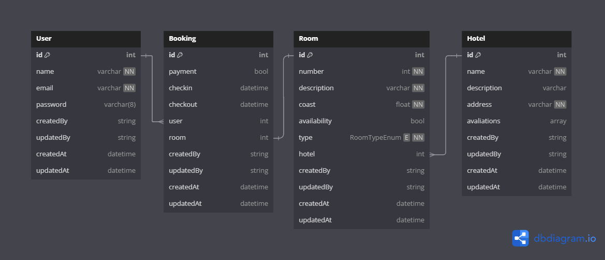

# Hotelium - Booking Manager 🏨🌍💼

## Hotel booking manager


### Hotelium is a hotel booking manager that allows users to create accounts, search for hotels, view hotel details, and make reservations.

**Project Name:** Hotelium 🏨🌍💼

**Development Start Date:** 23/11/2023 ⏩

**Status:** Paused 🛑

**Technologies used:** ☕ Spring Boot | Ⓜ Maven | 🔐 Spring Security | 💾 MySQL | 🚈 Railway | 🪂 Swagger | 🟠 Postman

🚈 **Railway Deploy Link:** [_Coming soon_](http://localhost:3000)

🪂 **Swagger Link:** [_Coming soon_](http://localhost:3000)

🟠 **Postman Import File Link:** [Hotelium Postman](./assets/postman/postman-hotelium.json)

## Project Description 📝

Hotelium is a comprehensive solution designed to simplify the management of hotel bookings. It provides users with a seamless experience from account creation to booking confirmation, ensuring efficiency and ease of use for both hotel managers and guests.

## Project Features 🔧

1. **User Registration & Authentication:** Create an account and log in securely.
2. **Hotel Search:** Search hotels by destination, check-in/out dates, and guest details.
3. **Hotel Details:** View descriptions, amenities, and room prices.
4. **Room Booking:** Select and reserve rooms with payment details.
5. **Booking Management:** View, manage, and cancel reservations.

## Project Entities 📚



## Development Stages 🛠️

Development followed clear stages from environment setup to final documentation. For details, refer to the [`project.todo`](./project.todo) file in the project root.

## Configured Routes 🚀

The [`postman-hotelium.json`](./assets/postman/postman-hotelium.json) file in the project contains all configured routes. You can import this file into Postman and start using the routes without manually exploring the code. Additionally, JSON bodies for tests are already saved in the files.

## About Swagger 🪂

Swagger provides a user-friendly interface to explore and test the API endpoints. You can access the Swagger UI at [Hotelium Swagger](https://hotelium.up.railway.app/swagger-ui/index.html).

## About Spring Security 🔐

Spring Security is a powerful and flexible framework that focuses on authentication and authorization within Java applications. It helps secure the application by managing user access based on roles and permissions, protecting endpoints, and ensuring that sensitive operations are only available to authorized users.

In Hotelium, Spring Security is integrated to handle user login, protecting the application against unauthorized access. It provides a robust security layer that includes features like password encryption, token-based authentication, and protection against common vulnerabilities.

For testing purposes, you can use the following credentials at `{{base_url}}/auth` route:

```json
{
   "email": "email@email.com",
   "password": "hotelium"
}
```

## Railway Deployment Notice ⚠️

Please note that Railway may be deactivated due to inactivity or other technical reasons. If this happens, you may need to clone the repository to your machine and connect to the database locally.

## Installing the Project 🛠️

Clone the repository:

```bash
git clone https://github.com/LadyJessie19/Hotelium.git
```

## Running the Application 🚀

To start the application:

1. Navigate to the project directory.
2. Run the following command to build and start the application:

```bash
mvn spring-boot:run
```

This will start the application on the default port, typically `8080`.

## Running with Postman

1. Import the file [`postman-hotelium.json`](./assets/postman/postman-hotelium.json) into Postman.
2. Create a new environment in Postman.
3. Set the environment variable `base_url` with the server address:

   - If running locally, the `base_url` will be `http://localhost:8080`.
   - If running on Railway, the `base_url` will be `https://hotelium.up.railway.app`.
   - **Note**: I prefer not to include the "/" at the end of the `base_url` variable, so I add it manually in each route.

4. Set another environment variable called `token` for the authentication token:

   - **Explanation**: To automate tests, I created a script within the `Login` route that generates the token and saves it in the environment variable. A test user is available in the database (if still active) with the following credentials:

   ```json
   {
     "email": "email@email.com",
     "password": "hotelium"
   }
   ```

- **Note**: All of this is already saved in the Postman import file. Just run the request to `{{base_url}}/auth` for the `token` variable to be updated automatically. Oh, and all requests are already configured with `Token` in the _Authorization_ headers configuration. 🥳

Ready! Now you can test the routes and access the files. 😉

## Development Team 🙋‍♀️


- Developer: [Jessie M Bentes](https://github.com/LadyJessie19)

## How to Contribute 🆘

If you want to contribute to the project, follow these steps:

1. Fork the project.
2. Create a new branch (`git checkout -b feature/new-feature`).
3. Commit your changes (`git commit -am 'Add new feature'`).
4. Push to the branch (`git push origin feature/new-feature`).
5. Create a new Pull Request.

## License 🧐

This project is licensed under the [MIT License](https://opensource.org/licenses/MIT).
